# starter-discord-bot

Follow these instructions after deploying this repo on Cyclic.sh

[](https://deploy.cyclic.app/)

## Set-up and configuration

### **1.** Create discord application

Navigate to Discord's developer portal and create a new application

- https://discord.com/developers/applications

<p align="center">
    
</p>

### **2.** Get application keys and parameters

After creating the application, you are taken to the application's dashboard. There you can configure an app icon, description, etc.

Retrieve:

- `APPLICATION ID` (Discord also calls this `CLIENT ID`)
- `PUBLIC KEY`

Configure your Cyclic App with these environment variables.

<p align="center">
    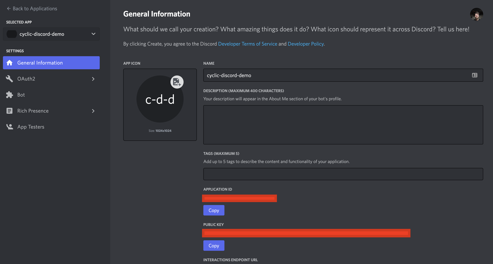
</p>

### **3.** Enable the Bot in the application

On the left hand side, go to `Bot` then click on `Add Bot`

You will need to create the bot token.
Press `Reset Token` and confirm.

<p align="center">
    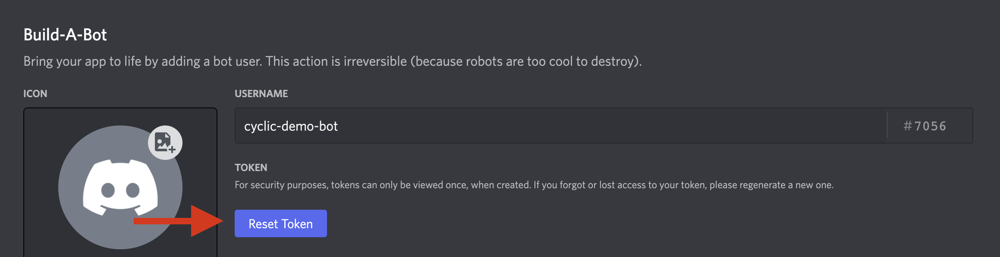
</p>

Retrieve the `TOKEN` string and configure your Cyclic App with this environment variable.

### **4.** Adding the bot to your server

The easiest way to add the bot to your server is via url.

Go to `OAuth2` > `URL Generator` on the left, select the permissions:

- `applications.commands` - allows you to register slash commands
- `bot` - this will show additional permissions for the bot
  - `Send Messages` - to allow the bot to send messages

<p align="center">
    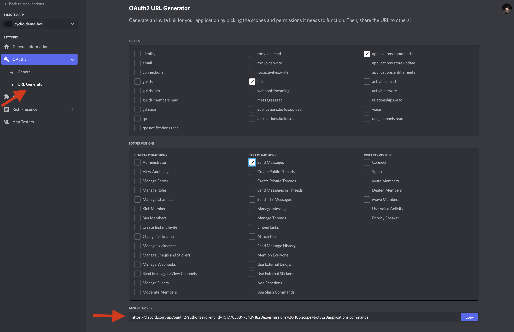
</p>

Copy and navigate to the generated URL at the bottom.

The page will ask you to select a server to install your bot on, it will go through a few prompts to verify that you are human.

<p align="center">
    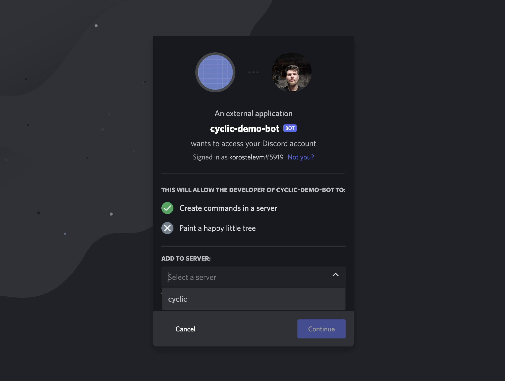
</p>

After you authorize, the bot will appear in your server.

<p align="center">
    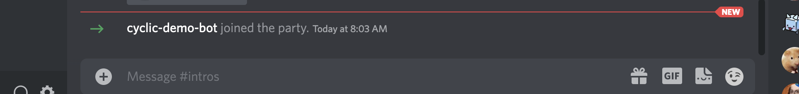
</p>

**Keep in mind, the bot does not yet have any code running, so it will not do anything just yet**

### **5.** Get your Server ID

To get the server id (Discord also calls this GUILD ID), you first have to enable developer mode for in your discord user settings > advanced:

<p align="center">
    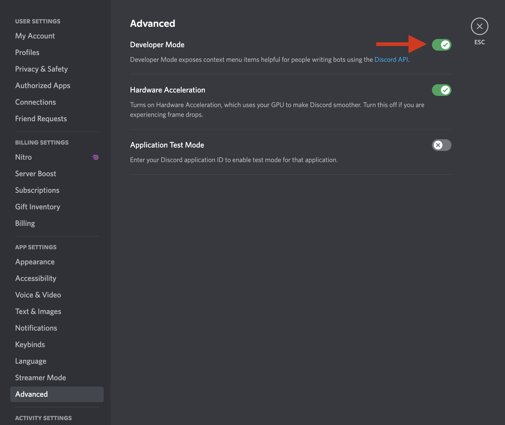
</p>

With developer mode on, you will be able to right click the discord server name to copy it's id:

<p align="center">
    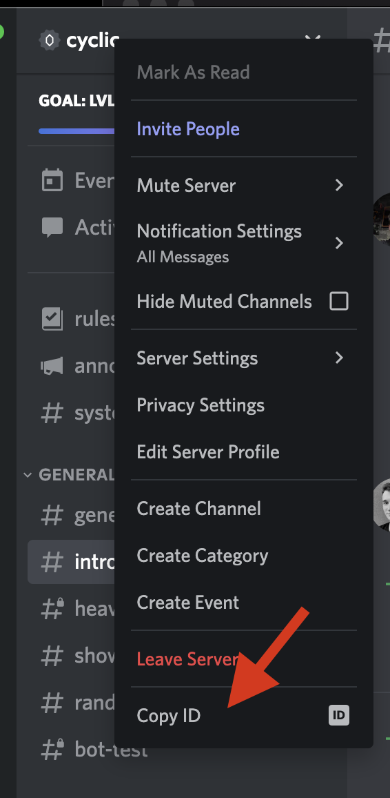
</p>

Developer mode allows you to right click all kinds of things in discord to get their id's (channels, users, messages, etc.)

## **6.** Set up environment variables

At this point, make sure you've collected all the variables you will use in your environment

- CLIENT_ID (same as Application ID)
- PUBLIC_KEY
- TOKEN
- GUILD_ID (same as Server ID)

<p align="center">
    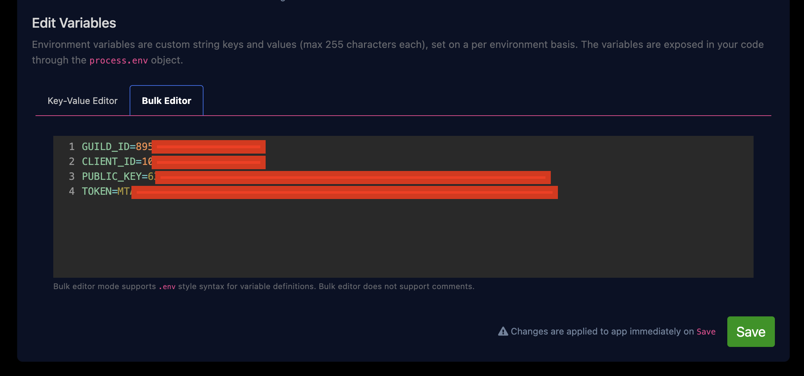
</p>

# Set up interactions endpoint

**This step is VERY IMPORTANT**, it lets discord know the url at which the bot is running. Discord will send interaction event payloads to this endpoint.

<p align="center">
    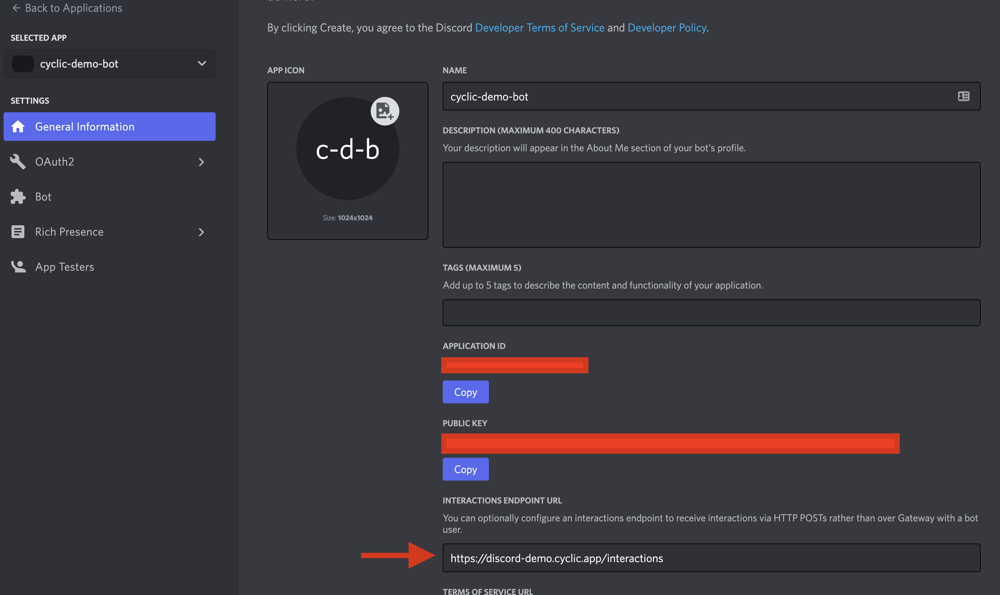
</p>

When you first enter the endpoint into the ui, discord will make a cryptographically signed request to your endpoint and expect you to verify the signature. This will establish trust between discord and your hosted bot.

1. Make sure your bot is deployed to Cyclic
2. Before entering the endpoint **make sure** the environment variables have been properly configured and that `process.env.PUBLIC_KEY` is set.
3. Enter the your Cyclic App url as the endpoint url into discord and Save Changes (eg `https://[your bot's url].cyclic.app/interactions`)

- The `/interactions` endpoint is using the `verifyKeyMiddleware` function to verify the keys automatically

```js
app.post('/interactions', verifyKeyMiddleware(PUBLIC_KEY), async (req, res) => {
    ...
```

# Register slash commands

1. Make sure all of the environment variables have been correctly set up
2. Go to `https://[your bot's url].cyclic.app/register_commands`
   This route makes a put request to register two commands on your server: `/yo` and `/dm`
   `   app.get('/register_commands', async (req,res) =>{`

Refer to the [discord docs](https://discord.com/developers/docs/interactions/application-commands#bulk-overwrite-guild-application-commands) to extend this further

After registering commands, you should see them available in your discord server

<p align="center">
    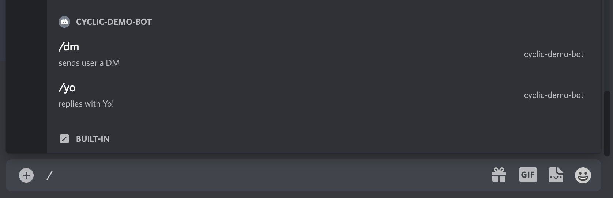
</p>

# Try the bot!

In any channel type `/yo` or `/dm`.

NOTE: this starter does not configure

## `/yo`

<p align="center">
    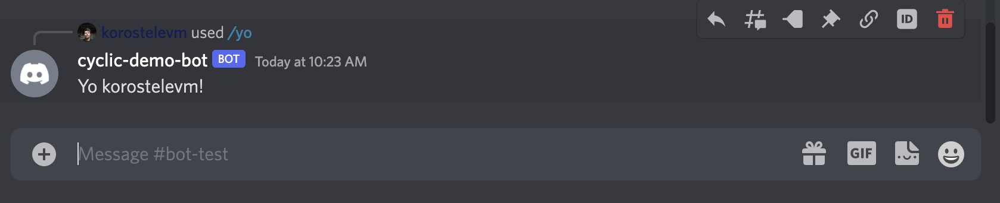
</p>

## `/dm`

<p align="center">
    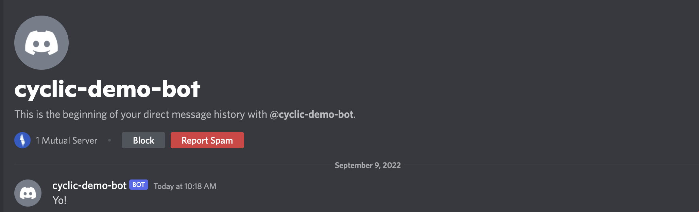
</p>

# StudyTimer ローカル開発環境構築

**事前準備**

- ngrok のインストール
- Discord Bot の作成
- APPLICATION_ID, TOKEN, PUBLIC_KEY, GUILD_ID の取得

1. cp .env.example .env
2. .env の編集
3. docker-compose up -d
4. ngrok http 8989
5. General Information > INTERACTIONS ENDPOINT URL に「[フォワードされた URL]/interactions」を設定
6. 「http://_localhost_:8989/register_commands」にアクセスし、コマンド登録
7. Discord でコマンドを入力し、正しく処理されていれば完了

**動作確認したい場合のプロセス**
コード変更 > コンテナ再起動 > コマンド登録 > コマンド反映

# Semantic Commit Message

**コミットメッセージの一貫性と明確さを保つために、Semantic Commit Message の規則を採用しています**

`:wrench:` chore: (タスクファイルなどプロダクションに影響のない修正、実稼働のコードの変更は含めない)
🔧 chore: デバッグ用のログを削除

`:memo:` docs: (ドキュメントの更新)
📝 docs: API の使用方法を README に追記

`:sparkles:` feat: (ユーザー向けの機能の追加や変更)
✨ feat: ユーザープロフィール画面の追加

`:bug:` fix: (ユーザー向けの不具合の修正)
🐛 fix: ログイン時のエラーハンドリングを修正

`:recycle:` refactor: (リファクタリングを目的とした修正)
♻️ refactor: 変数名を明確にするためのリファクタリング

`:art:` style: (スタイルやセミコロンの欠落などの修正、実稼働のコードの変更は含めない)
🎨 style: コードのインデントを修正

`:microscope:` test: (テストコードの追加や修正、実稼働のコードの変更は含めない)
🔬 test: 新規登録機能のユニットテストを追加

`:construction_worker:` ci: (環境構築に関わる追加や修正)
👷 ci: バージョン変更に伴う Dockerfile の修正
